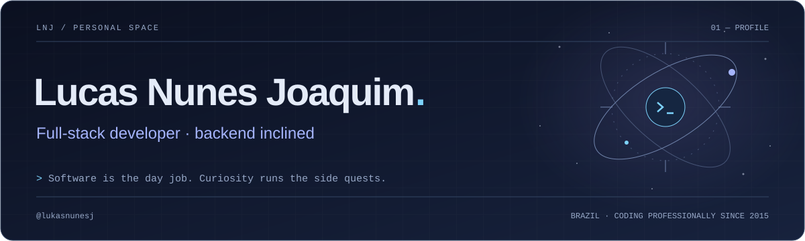
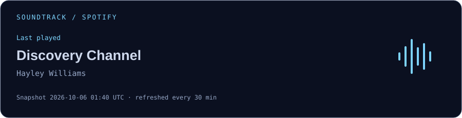
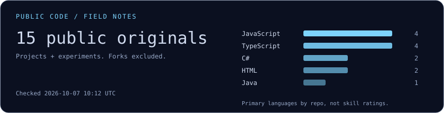

<picture>
  <source media="(prefers-color-scheme: dark)" srcset="assets/header-dark.svg">
  <source media="(prefers-color-scheme: light)" srcset="assets/header-light.svg">
  
</picture>

<p align="center">
  <a href="https://www.linkedin.com/in/lucasnunesjoaquim/">LinkedIn</a> ·
  <a href="mailto:lukasnunesj@gmail.com">Email</a> ·
  <a href="https://github.com/lukasnunesj?tab=repositories">Explore the repos</a>
</p>

### `01 / whoami`

```text
name      Lucas Nunes Joaquim
role      Full-stack Software Developer
focus     Backend · C# / .NET · TypeScript
since     2015, professionally
location  Countryside of São Paulo, Brazil
```

I've worked on enterprise systems and products: APIs, distributed services, integrations, and moving more data than anyone wants to inspect by hand. Lately I lean toward backend work, especially C# / .NET, Node.js and TypeScript.

This is also where the smaller, stranger ideas end up. Not everything needs a business case.

### `02 / toolbelt`

| Where | What I reach for |
| :--- | :--- |
| **Core** | **C# / .NET · TypeScript · Node.js** · PostgreSQL |
| **Interfaces** | React · Angular · Vue |
| **Infra** | Azure · AWS · Docker · GitHub Actions · observability |

<details>
<summary>Other tools I've worked with</summary>

Java, Ruby on Rails, PHP / Laravel, Python, SQL Server, MySQL, Redis, and Azure DevOps.

Depending on the system: event-driven architecture, messaging, DDD, CQRS, Clean Architecture, and TDD. Tools for a problem, not a checklist for every project.

</details>

### `03 / things I've built`

<table>
<tr>
<td width="33%" valign="top">
<h4><a href="https://github.com/lukasnunesj/prisma">prisma</a></h4>
<p>Personal finance dashboard. ASP.NET Core 8 API with EF Core and PostgreSQL, JWT with refresh-token rotation and CSRF protection, per-user data isolation, integration tests and CI. React frontend.</p>
<sub>C# / .NET 8 · auth · integration tests · CI</sub>
</td>
<td width="33%" valign="top">
<h4><a href="https://github.com/lukasnunesj/api-holerite">api-holerite</a></h4>
<p>Payslip estimator. ASP.NET Core 8 API applying the 2026 INSS and IRRF rules, including the Lei 15.270 reduction, checked against the Receita Federal's official examples. Built for a real person, deployed on Fly.io.</p>
<sub>C# / .NET 8 · xUnit · CI/CD</sub>
</td>
<td width="33%" valign="top">
<h4><a href="https://github.com/lukasnunesj/react-holerite">react-holerite</a></h4>
<p>The frontend for api-holerite: enter salary, extra hours and deductions and see the estimated payslip. <a href="https://react-holerite.fly.dev">Live demo</a>.</p>
<sub>React · Vite · Tailwind · Jest · Fly.io</sub>
</td>
</tr>
</table>

[More experiments, prototypes, and things I wanted to understand ↗](https://github.com/lukasnunesj?tab=repositories)

### `04 / soundtrack`

Rock, alternative rock, nu-metal. Probably a reasonable amount of Linkin Park. Probably.

<a href="https://open.spotify.com/">
  <picture>
    <source media="(prefers-color-scheme: dark)" srcset="assets/spotify-dark.svg">
    <source media="(prefers-color-scheme: light)" srcset="assets/spotify-light.svg">
    
  </picture>
</a>

<sub>A listening snapshot, not a live player. Refreshes every 30 minutes once connected.</sub>

### `05 / outside the terminal`

- **Games:** Outer Wilds, Tunic, Hollow Knight. Exploration, secrets, and finding out what that door was hiding.
- **Stories:** anime, manga, manhwa, and webnovels. Shadow Slave and Lord of the Mysteries fit the lore rabbit hole nicely.
- **Experiments:** new tools, AI-assisted development, little automations, and interfaces that are fun to look at.

### `06 / public signals`

<picture>
  <source media="(prefers-color-scheme: dark)" srcset="assets/activity-dark.svg">
  <source media="(prefers-color-scheme: light)" srcset="assets/activity-light.svg">
  
</picture>

<sub>Public experiments aren't a complete picture of my professional stack. A lot of the day job stays private.</sub>

#### The contribution graph has a small predator.

<picture>
  <source media="(prefers-color-scheme: dark)" srcset="assets/snake-dark.svg">
  <source media="(prefers-color-scheme: light)" srcset="assets/snake-light.svg">
  
</picture>

---

**Say hello:** [LinkedIn](https://www.linkedin.com/in/lucasnunesjoaquim/) · [Email](mailto:lukasnunesj@gmail.com) · [GitHub](https://github.com/lukasnunesj)
